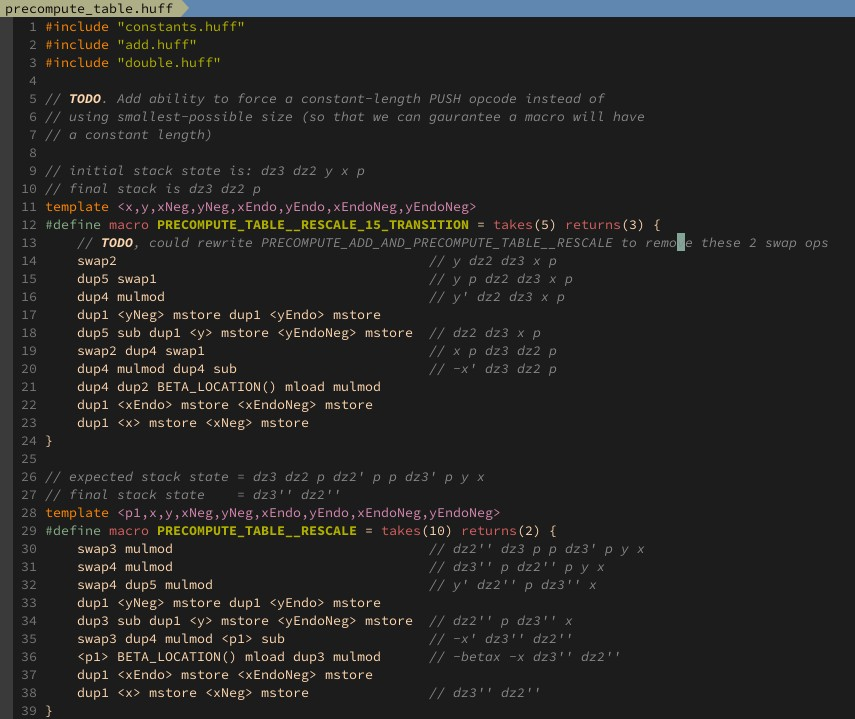

# vim-huff
Syntax files for [Huff](https://github.com/AztecProtocol/AZTEC/tree/master/packages/huff) (sort of). Currently doesn't do a ton, but enough to make Huff code readable. Hope to add some more features as I go.

## Usage
(Substitute your favorite package manager)  

`Plug 'wolflo/vim-huff'`
